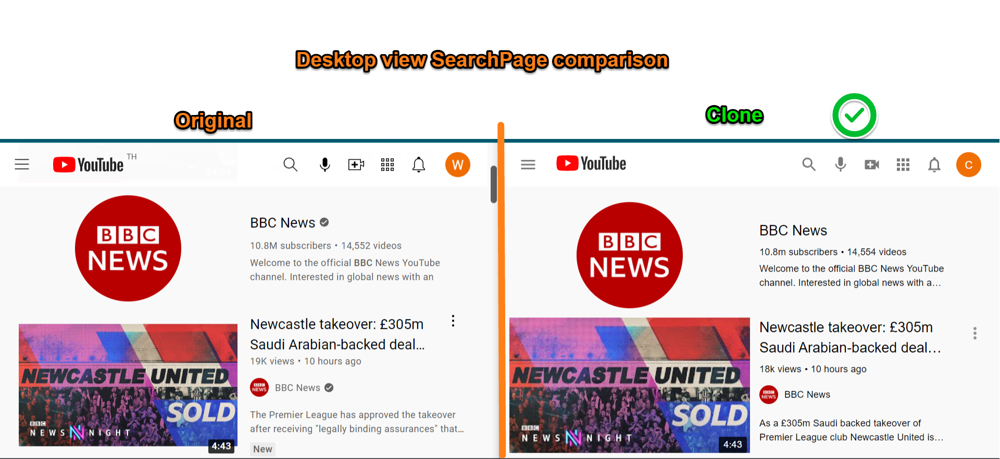

# YouTube Clone Frontend

A React-based frontend application that replicates the YouTube user interface and interacts with our Spring Boot backend.

## Demo of this app:


## Technology Stack

- **React.js** - Frontend library
- **Material-UI v4** - UI component library
- **Styled-components** - CSS-in-JS styling
- **React Router** - Client-side routing
- **Axios** - HTTP client for API requests
- **Jotai** - State management

## Features

- Modern, responsive UI that closely resembles YouTube
- Home page displaying most popular videos
- Video search functionality
- Video playback
- User authentication and registration
- Comment section for videos
- Like/dislike functionality
- Channel subscription
- User profile management
- Infinite scrolling for video lists

## Project Structure

```
frontend/
├── public/              # Public assets
├── src/
│   ├── components/      # Reusable UI components
│   │   ├── Header/      # Navigation header components
│   │   ├── Sidebar/     # Sidebar navigation components
│   │   ├── Videos/      # Video card and related components
│   │   ├── Search/      # Search functionality components
│   │   └── ChipsBar/    # Category filtering components
│   ├── pages/           # Page components
│   ├── api/             # API service functions
│   ├── context/         # React context for state management
│   ├── hooks/           # Custom React hooks
│   ├── utils/           # Utility functions
│   ├── assets/          # Images and static assets
│   ├── App.js           # Main application component
│   └── index.js         # Application entry point
├── package.json         # Project dependencies and scripts
└── README.md            # Project documentation
```

## Getting Started

### Prerequisites

- Node.js (v14 or later)
- npm or yarn

### Setup

1. Clone the repository:
   ```
   git clone https://github.com/yourusername/youtube-clone.git
   cd youtube-clone/frontend
   ```

2. Install dependencies:
   ```
   npm install
   # or
   yarn install
   ```

3. Configure the backend API URL:
   Create a `.env` file with:
   ```
   REACT_APP_API_BASE_URL=http://localhost:8080/api
   ```

4. Start the development server:
   ```
   npm start
   # or
   yarn start
   ```

The application will open in your browser at `http://localhost:3000`.

## Building for Production

```
npm run build
# or
yarn build
```

This will create an optimized production build in the `build` folder.

## Integration with Backend

This frontend connects to the Spring Boot backend via REST API calls. Key integration points:

- Authentication - JWT token exchange
- Video fetching and filtering
- User profile management
- Video interactions (likes, comments, etc.)

Make sure the backend server is running before starting the frontend application.

## Mobile View Support

The application is responsive and provides different layouts for desktop and mobile viewports:

- Mobile view has a specialized search interface
- Navigation adjusts based on screen size
- Video grid adapts to screen dimensions

## Detailed side-by-side comparison of the clone to the original





## License

This project is open source and available under the MIT License.
